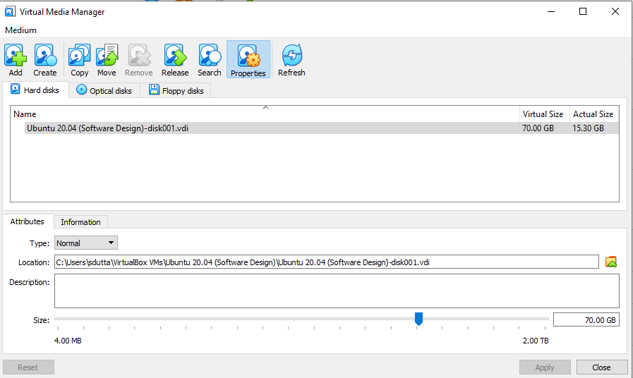
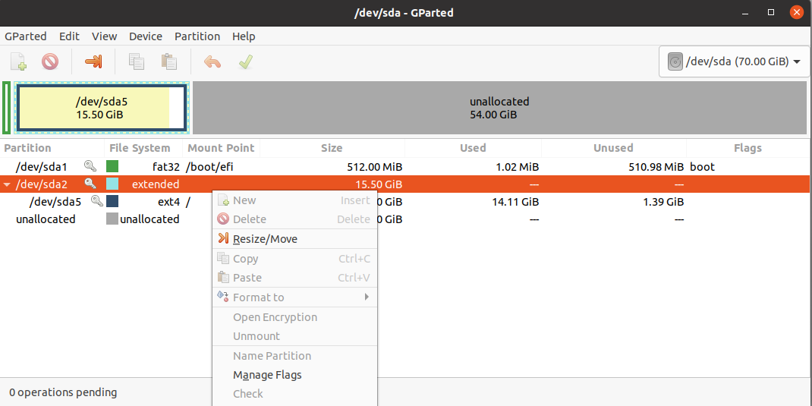
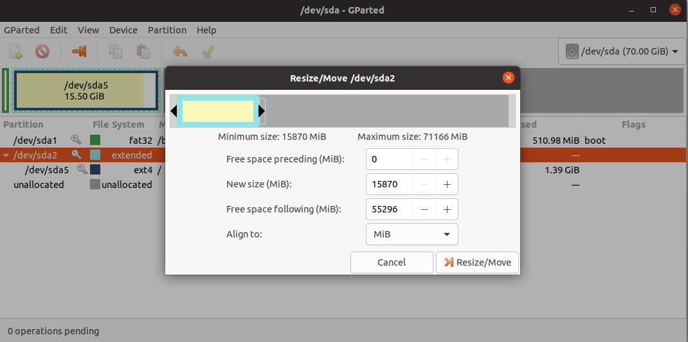
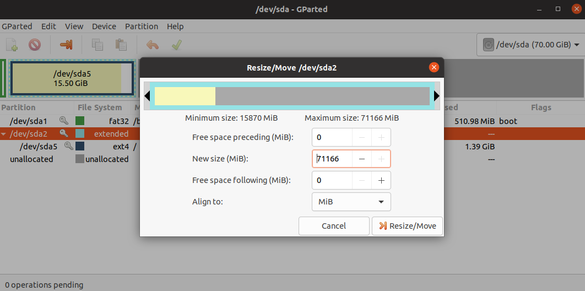
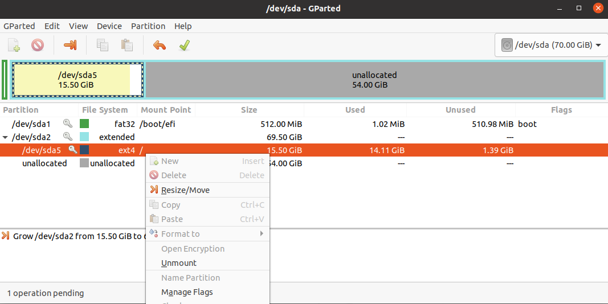
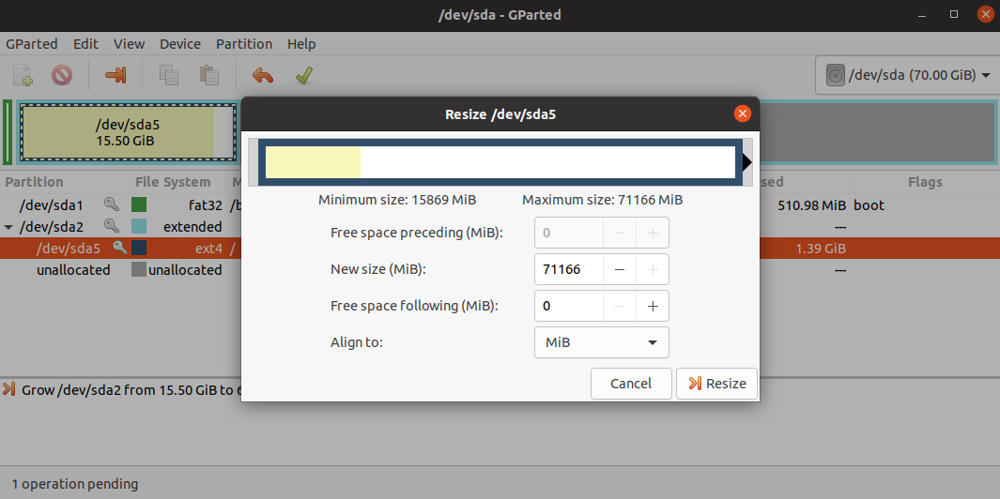
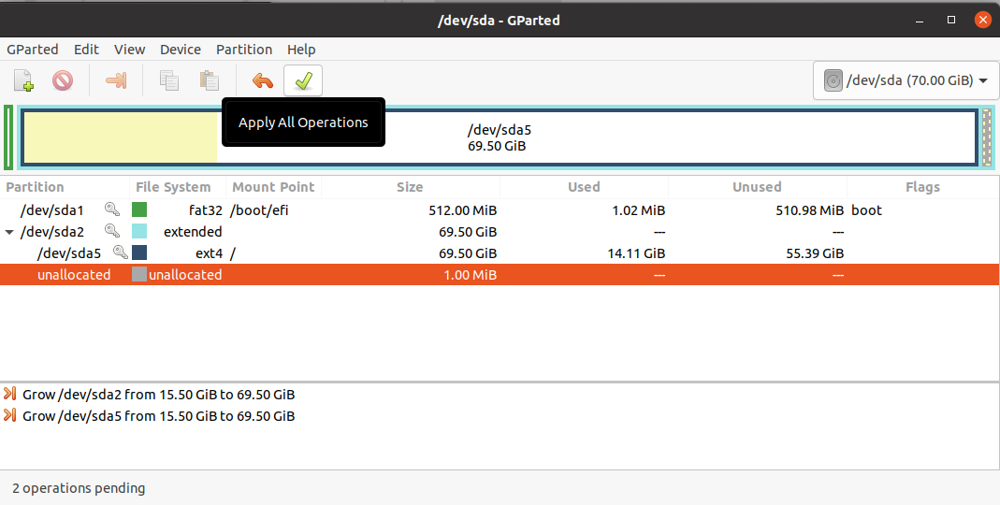

## Purpose of this How-to

If you are installing the QEA software within VirtualBox (e.g., you are using VirtualBox for SoftDes), this guide will walk you through the process of clearing enough space on your disk.

## How Much Space Do I Need?

Just to be safe you should clear 20 GB for the ``qeasim`` environment.

## Step 1: Configuring the VirtualBox Media

Open VirtualBox, make sure VM is stopped, and under the ``File`` menu click on ``Virtual Media Manager``.  Find the virtual disk that corresponds to your VM (probably there will just be one choice) and click the ``Properties`` button (if you have issues finding this button, try [this guide](https://appuals.com/using-virtual-media-manager-in-oracle-vm-virtualbox/)).

Once you have the properties screen up, adjust the ``Size`` slider to give yourself more space.  If you have a dynamically allocated disk, you may not be able to do this.  If that's the case, you should be okay skipping the rest of this section (there's nothing you have to do now).


Here is an example of what this view might look like after you give yourself more space.



## Step 2: Increasing the Disk Size from within the VM

Startup your Ubuntu VM.  You will be performing the rest of the steps from within your VM.

Install the program ``gparted`` by running the following command from a terminal.

```bash
sudo apt-get install gparted
```

Launch gparted us the superuser using the following command from a terminal.

```bash
sudo gparted
```

This should bring up the gparted GUI.  Your first step is to right click on your ``extended`` partition and click the ``Resize / Move`` option (see image below).



Once you click this option, you will see the following window.



Drag the slider to increase the space allocated to your extended partition to the desired amount.  If you have a Fixed disk (i.e., you were able to drag the slider in the VirtualBox Media Manager), you will probably want to drag it all the way to the right.  Once you've dragged it to where you want it, your window will look like this.



Go ahead and click ``Resize/Move``.  Next, you will be repeating this process for your ext4 partition.  Right click on the ext4 partition and click ``Resize/Move`` to bring up the window that will allow you to resize the partition.



Use the slider to allocate all of the available space to the ext4 partition.  Your window should look like this.



Go ahead and click the ``Resize`` button.  The final step is to apply your changes. Click the check mark button to apply changes (you will be asked to confirm your changes).



Once the operations have been applied, you should be good to go!  You can go ahead and close ``gparted``.
