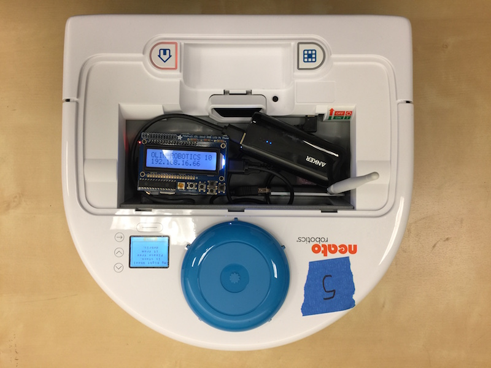
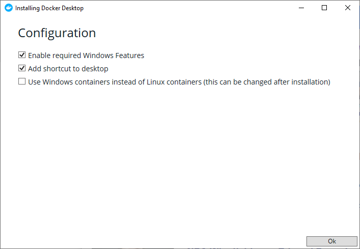
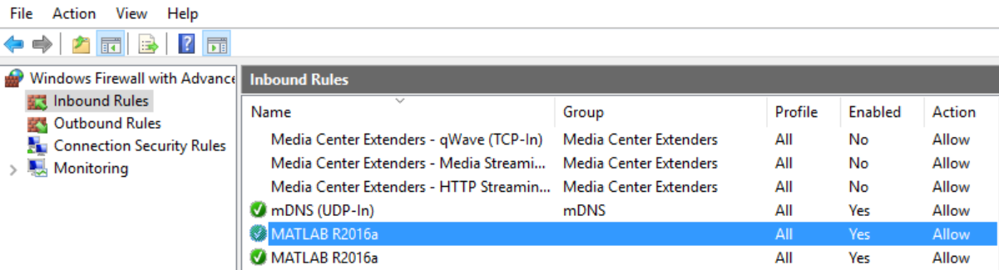
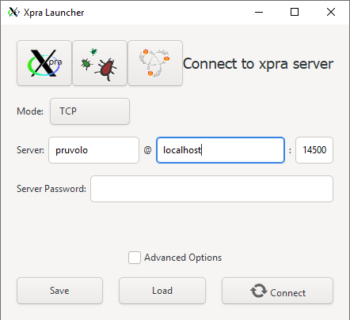
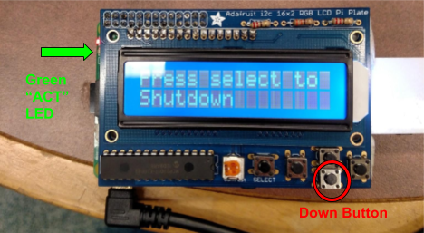
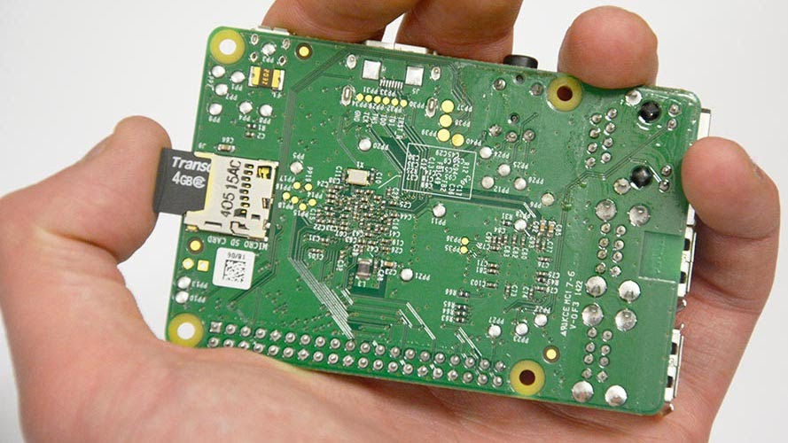

## Overview

In module 3 we will be programming the Neato BotVac. The Neato is a powerful, low cost robot platform that we have customized for QEA (it's also technically a vacuum cleaner, but we'll be ignoring that for this module!). We have engineered the platform to abstract away a lot of the frustrating bits, allowing you to focus on learning the really fun robotics, physics, math, and computing content.

<p align="center">

</p>

The robots have each been outfitted with a Raspberry Pi.  The Raspberry Pi is a low cost, Linux computer that will serve as a bridge between your laptop and the robot.  To use the robot you will initiate a connection from your laptop, via the Olin network, to the Raspberry Pi.  Once the connection has been made, the Raspberry Pi will start talking to the robot.  All sensor data will then be streamed from the Raspberry Pi to your laptop over Olin's wireless network.  Your laptop will process this sensor data and then send motor commands to the robot over the same network.  In this way, all important computation will be done on your laptop.  This architecture simplifies the sharing of robots and makes debugging and editing code as easy as possible.

Since you are not modifying the code running on the Raspberry Pi, each robot will function identically (i.e. there is no software you need to modify on the robot).  While we do have enough robots (18) to give each table their own robot, that wouldn't be optimal.  For example, sometimes your robot will run out of batteries, and you'll want to grab another robot while yours charges.

We'll be programming the robots using ROS.  ROS is a powerful, open-source framework for robotics that has been widely adopted in both industry and academia.  ROS runs natively on Linux, however, we are supporting Windows and Mac OSX via Docker.  Therefore, you can connect to the robots through Windows, Linux, or Mac OSX.

## Environment Setup

The purpose of this document is to get you up and running with your Neato robot.  After following these instructions you will be able to connect to your robot, examine its sensor data, and drive it around.

## Target Environment

ROS supports several programming languages out of the box, including C++, Python, and Java.  Additionally, MATLAB's Robotics System Toolbox includes support for ROS as well.  In this document and in this module, we will walk you through setting up your environment to connect to the robots using Windows, and we will show you how to program the robots using MATLAB.  Some folks, especially those in SoftDes, may want to use Ubuntu instead.  This is totally fine, and we have instructions [on how to setup your environment for Ubuntu](#notes-for-working-in-linux).  If you'd like, you can also use Mac OSX.  You may be tempted to use Python to program the robots, however, we discourage you from doing so.  The reason is that we will have a lot of scaffolding / tutorials written in MATLAB, and the extra effort in mapping things over to Python is a hurdle that we don't want you to have to contend with.  Additionally, there are some things we will be doing with the robots that will work better in MATLAB (e.g., the operations may be faster, visualization / debugging may be easier).

## Docker Setup

### Highly Recommended Pre-Install Instructions

For lots of folks, you will be able to skip this step, but we have noticed that some of the student Dell laptops will not be able to complete the Docker install process without doing these steps.  In any case, these steps do not hurt to do even if you could have gone through the installation without performing them.  As a result, we encourage you to do them.  If you are interested in why we have to do this, you can check out the Docker help article [Manually Enable Docker for Windows Prerequisites](https://success.docker.com/article/manually-enable-docker-for-windows-prerequisites).

In this step you'll be manually enable the Hyper-V and Container Features, which are both necessary for Docker.  First, run PowerShell by typing "powershell" into the windows search bar and then selecting "Run as Administrator" in the menu that appears to the right.  

In the PowerShell window that pops up, type the following two commands (tip: when asked if you want to restart your computer after entering the first command, answer "no", and then answer "yes" to the same question after entering the second command.  This will save you one reboot).

```powershell
Enable-WindowsOptionalFeature -Online -FeatureName containers -All
Enable-WindowsOptionalFeature -Online -FeatureName Microsoft-Hyper-V -All
```
You will likely need to restart your computer after completing these steps. Once you've completed the restart process, you can run the Docker installer.

### Running the Docker Installer

The only operating systems officially supported by ROS are Ubuntu and Debian.  However, using a virtual machine you will be able to run ROS in Windows 10.  The tool we will be using to accomplish this is Docker.  To install Docker, download and run the installer from [DockerHub](https://hub.docker.com/editions/community/docker-ce-desktop-windows/) by clicking the "Get Docker" link. When you see two checkboxes, leave both as is; do not check the third option. You want to run Docker with Linux containers, not Windows containers, so that we can use Docker to run Linux code. Your selections will look like this.

<p align="center">

</p>

Once the install is complete you may be asked to restart your computer.

### Making Sure Docker is Setup Properly and Troubleshooting

Once the Docker installation has completed (and you have possibly restarted your computer), you should run Docker desktop by either clicking on its icon on your Desktop (the icon looks like a smiling whale) or from the Windows 10 start menu.  If everything is working properly, you will see a message pop up that says something like "Docker is Running.  Open PowerShell to start hacking" (it takes a bit of time for this to show up upon reboot, so be patient). Sometimes Docker will say that it will take a few seconds to be up and running, but in our experience it often takes longer. 

You can also check the status of Docker by clicking on the Docker Desktop icon in the status bar at bottom-right of your screen.

As a final check, type the following command into PowerShell (which you can open via the Windows search box).

```powershell
docker run hello-world
```

If all went well, you should see output that starts with text like.

```
Hello from Docker!
This message shows that your installation appears to be working correctly.
```

#### Issue: Docker Installer Got Stuck "Deploying Required Windows Features"

First, if you are having any issues with any of this (e.g., installing Docker), e-mail the QEA teaching team with a description of the problem!  If you ran into the issue where the installer got stuck, it is likely because you need to manually enable the required windows features as described in [this previous section](#highly-recommended-pre-install-instructions).

#### Issue: Docker Still Won't Start 

There are some reports that Windows security features are interfering with the Virtual Machine software that Docker uses.  If Docker still won't start properly (e.g., as indicated when you click on the Docker Desktop icon or when you try to run the hello-world image), try the following steps.


1. Open "Window Security"
2. Open "App & Browser control"
3. Click "Exploit protection settings" at the bottom
4. Switch to "Program settings" tab
5. Locate "C:\WINDOWS\System32\vmcompute.exe" in the list and expand it
6. Click "Edit"
7. Scroll down to "Code flow guard (CFG)" and uncheck "Override system settings"
8. Start vmcompute from an administrator PowerShell
```powershell
net start vmcompute
```

## Downloading the QEA Docker Images

For a typical broadband Internet connection, the resulting series of downloads should take less than 10min.  If it gets completely stuck for longer than that, just close the window and retry. These downloads are the "container" of code that has what's called an "image"--a collection of root filesystem changes and execution parameters. These commands allow your computer and the robot to communicate with each other via MATLAB. 

Assuming Docker is working properly, open the windows "Run" dialog box by hitting the Windows key and 'r' simultaneously.  Type (or cut and paste) the following command into the textbox that pops up and then hit enter (note: you can also use PowerShell for these commands if you commit the "cmd /c" and type them directly into Powershell).


```
cmd /c docker pull qeacourse/robodocker:simulated
```

You will likely see output resembling the following.
```
simulated: Pulling from qeacourse/robodocker
5c939e3a4d10: Pull complete 
c63719cdbe7a: Pull complete 
19a861ea6baf: Pull complete 
651c9d2d6c4f: Pull complete 
da5d3d671a39: Pull complete 
62812d1f6ed8: Pull complete 
290e7247cb8c: Pull complete 
147359e88db8: Pull complete 
89f68f113cd1: Pull complete 
660b40b12364: Pull complete 
4e2f6c475740: Pull complete 
209f2dab1772: Pull complete 
6bc1d12dae4d: Pull complete 
0842ca541816: Pull complete 
3c2447942622: Pull complete 
4d794dd896bd: Pull complete 
5b83bc858ada: Pull complete 
36d3fd4ed035: Pull complete 
1be3b1332f4a: Pull complete 
52fe9b69a49e: Pull complete 
4caf43594103: Pull complete 
330cdcf8eb64: Pull complete 
52764e418589: Pull complete
```
Repeat the process above (i.e., run them in them using the "Run" dialog box) for each of the following three commands to download the images necessary for each of the robot challenges.

```
cmd /c docker pull qeacourse/robodocker:actual
```

```
cmd /c docker pull qeacourse/robodocker:flatland
```

```
cmd /c docker pull qeacourse/robodocker:gauntlet
```

## Install Xpra (only needed for simulator)

We will be using Xpra to view the simulated robot.  Follow the [download and install instructions on the Xpra website](https://xpra.org/trac/wiki/Download)

## Checking Your Firewall Settings

In order to allow MATLAB to properly communicate with Docker, you need to make sure you have the right firewall settings.  When you run MATLAB for the first time, you were asked whether or not to allow incoming connections to this application.  If you selected "yes", you are good.  If you selected "no", or if you don't remember what you selected (which is probably most people!), then we need to make sure you have the right settings.

1. Type wf.msc into the run dialog (remember, hit the Windows key and "r" simultaneously to bring up the dialog).  This will bring up a dialog that shows your firewall settings.
2. Click on Inbound Rules
3. Browse the list for two rules that say "MATLAB R2019a" (assuming you are using this version of MATLAB.  If you are using a different version of MATLAB, you should look for rules labeled with that version.). If you do not see MATLAB, go on and come back to this later once you have connected to the robots.
4. Click on one of these two rules (you will repeat this process for both), and click the properties button on the right panel of the window.
5. Make sure the following settings are chosen:
* Under the "General" tab, make sure "Enabled" is checked and that "Action" is set to "Allow the connection".
* Under the "Advanced" tab, make sure that "Domain", "Private", and "Public" are all checked and make sure that "Edge traversal" is set to "Defer to user".
Repeat step 5 for the second firewall rule.
6. If you have done this correctly, your "Inbound Rules" list should look like the ones below (note: on this computer the version of MATLAB was R2016a).


## Running the Neato Simulator

Open the run dialog (by hitting Windows key and “r”).  Paste in the following command, and hit enter (unfortunately, the command is super long, but all parts are necessary).

```
cmd /c docker run --name=neato --rm --sysctl net.ipv4.ip_local_port_range="32768 33000" -p 11311:11311 -p 14500:14500 -p 32768-33000:32768-33000 -it qeacourse/robodocker:simulated
```

After waiting about 30 seconds for the simulator to be up and running, you can connect to the visualization of the simulator using Xpra.

<ol>
<li>Open Xpra</li>
<li>Cick "connect"</li>
<li>Make sure "Mode" is set to "TCP", server should be "yourname" @ localhost : 14500 (note: It doesn't actually matter what you put for yourname, just put something).  Leave "Server Password" blank.  Your window should look like this.
<p align="center">

</p>
</li>
<li>Click "Connect"</li>
</ol>

You can program the simulated robot using the same procedure as the physical robot with the following differences (we are actively working to eliminate these discrepancies so that the simulator will be as close to the physical robot as possible).

* the /bump topic doesn't work in the same way as on the actual Neato
* the /encoders topic doesn't work in the same way as on the actual Neato
* the /accel topic doesn't work in the same way as on the actual Neato

## Connecting to the Neatos

### Step 1: Grab a battery for the raspberry Pi

Checklist before performing this step:

1. The battery indicator light should be at least level 2 (preferably full)

### Step 2: Choose your Neato

Checklist before performing this step:

1. Make sure the Neato's batteries are charged.  To test this, pull the Neato away from it's charging station and for the newer Neato's hit the button near the front bumper of the Neato that has the home icon on it. For the older Neato's hit the larger orange power button.  The display should illuminate revealing a battery capacity indicator.  Sometimes you will have to click the button below the display to dismiss any errors that show up on the Neato’s screen before the battery level is displayed.

### Step 3: Connect the USB battery pack to the Raspberry Pi's USB cable.

It should take about 1 minute for the robot to be ready to use (see step 4 for a final checklist).

### Step 4: Connecting to the Neato from Your Laptop

Checklist before performing this step:

1. Raspberry pi display backlight is illuminated and not flashing on and off (see troubleshooting section for what to do if this is not the case)
2. Raspberry pi display shows that the Neato is connected to the OLIN-ROBOTICS network and has an IP address assigned to it.
3. Raspberry pi display shows that the signal strength of the Neato's connection is at least 70 (the max is 99) for the wifi dongles with antennas, and at least 50 (max is 65) for the dongles without antennas.  Note: If the signal strength is too low see troubleshooting section for more information.
4. Your laptop is either connected to the ethernet or the OLIN wifi network (Note: this will not work if you are on OLIN-GUEST).

Open the run dialog (by hitting Windows key and “r”).  Paste in the following command, and hit enter (unfortunately, the command is super long, but all parts are necessary).  Replace the part that says HOST=192.168.16.74 with the IP address of your robot (the IP address can be found from looking at the display of the Raspberry Pi on your Neato).

```
cmd /c docker run --name=neato -e HOST=192.168.16.68 --rm --sysctl net.ipv4.ip_local_port_range="32768 33000" -p 11311:11311 -p 14500:14500 -p 32768-33000:32768-33000 -it qeacourse/robodocker:actual
```

You can verify this worked because the robot will start making a quiet whirring sound and the laser (visible from the side) will start rotating. You should also see in the command window that you are "connected".

### Step 5: Shutting Down the Raspberry Pi

When you are done working with the robot it is important to properly shutdown the raspberry pi. DO NOT just unplug the battery. To shutdown the pi, push the "down" button until you see the message "Press select to Shutdown". Press select and wait for the green "ACT" LED on the left side of the Pi to flash steadily ten times then stay off. It is then safe to unplug the battery.

<p style="text-align: center;">

</p>

## Programming the Robot in MATLAB

Next, fire up MATLAB.  In order to connect MATLAB to the robot, type the following into the MATLAB command window.

```MATLAB
rosinit('localhost',11311, 'NodeHost','host.docker.internal')
```

If all goes well you should see output similar to this.

```
Initializing global node /matlab_global_node_38893 with NodeURI http://host.docker.internal:57999/
```

Now that you are connected, you can see the list of topics by typing the following command into the command window.

```MATLAB
rostopic list
```

Each of these topics is either a sensor channel (e.g., laser scanner, bump sensor, wheel encoder) or a motor control channel (e.g., cmd_vel, raw_vel, etc.).  Go ahead and display the data flowing across the /bump topic by typing the following command in the command window.


```MATLAB
rostopic echo /bump
```

You should see output like this.

```
  Data   :  [0, 0, 0, 0]
  Layout    
    DataOffset :  0
    Dim        :  []
```

The interpretation of each of these numbers is dependent on the particular topic you are examining, however, in the case of the /bump topic the four numbers in Data correspond to the output of each of the four bump sensors on the robot.  Go ahead and push the front bumper of the robot to see which bump sensor corresponds to which number.


As always, you can use Ctrl-C to terminate the execution of any Matlab script so you can keep programming.

### Your First MATLAB Robotics Program

Let's go ahead and create a program to drive the robot forward until it rams into something.  To do this we'll need to first learn how to control the robot's wheels.  In order to send a velocity to each of the robot's wheels we will need to create a publisher for the /raw_vel topic.

```MATLAB
pub = rospublisher('/raw_vel');
```

Once we have a publisher, we can create a message suitable for sending on that topic.

```MATLAB
msg = rosmessage(pub);
msg.Data = [.1, .1];
send(pub, msg);
```

This message corresponds to telling the robot’s wheels to each move forward at a velocity of 0.1 m/s.


If your robot is not moving, return to your firewall settings and make sure ALL MATLAB inbound rules are as described above. (There could be new inbound rules now that you've connected to the robot.)


We can create subscribers to topics using the rossubscriber command.

```MATLAB
sub_bump = rossubscriber('/bump');
```

We can put these two together to create a simple program where the robot will move forward with a constant velocity (in this case 0.1 m/s) until one of the bump sensors is triggered.  You can put this code in a MATLAB script (e.g., driveUntilBump.m).


```MATLAB
pub = rospublisher('/raw_vel');
sub_bump = rossubscriber('/bump');
msg = rosmessage(pub);

% get the robot moving
msg.Data = [0.1, 0.1];
send(pub, msg);

while 1
    % wait for the next bump message
    bumpMessage = receive(sub_bump);

    % check if any of the bump sensors are set to 1 (meaning triggered)
    if any(bumpMessage.Data)
        msg.Data = [0.0, 0.0];
        send(pub, msg);
        break;
    end
end
```

## Tips and Tricks

None of the stuff in this section is required, but we'll use it to document some
 useful features of our setup.

### Turning Off (and On) the Simulator Visualization to Reduce CPU Usage

When you first fire up the Robot simulator, you'll notice that your fans may start whirring quite a bit due to increased CPU usage.  Some portion of this usage is necessary just to simulate the robot, but a the bulk of it is actually used by the graphical visualizer of the simulation (the one you connect to through xpra).  If you want to be able to toggle the visualizer on and off (and thereby reduce the CPU usage when the visualizer is off), you can use the following commands.

To turn off the simulator visualizer, run the following command in a PowerShell.
```powershell
docker exec neato /bin/bash -c "pkill gzclient; pkill xpra"
```

To turn the simulator visualizer back on (note: it's on by default), run the following command in a PowerShell.
```powershell
docker exec neato /bin/bash -c "xpra start --start=gzclient --bind-tcp=0.0.0.0:14500"
```
*Note:* to actually see the visualization, you will have to connect to it using Xpra as described in the [Running the Neato Simulator](#running-the-neato-simulator) section.

## Notes for working in Linux

Warning: we haven't tested the MATLAB installation for Linux lately.  Please direct issues to the IT helpdesk.

First, make sure you are running Matlab r2016b or later. The installer can be found on Public, as described here on the [IT Wiki Page](http://wikis.olin.edu/linux/doku.php?id=matlab) (warning: need to be on VPN to access this page). Two tips:

1. Copy the .deb file from Public to your computer before installing to make the process go much faster.
2. If the version doesn't get updated properly, try using the command line sudo dpkg -i Matlab_R2016b_9.1.0.441655-1.deb instead of the GUI

Follow the [Linux Docker install instructions](https://docs.docker.com/engine/installation/linux/ubuntu/#install-docker)

You want Docker CE, not Docker EE

### Post installation steps

Perform the steps to [manage Docker as a non root user](https://docs.docker.com/engine/installation/linux/linux-postinstall/#manage-docker-as-a-non-root-user)

Then restart computer.

Follow the instructions for Windows for getting the QEA Docker images, but use the terminal instead of Powershell.  Any instructions for typing things into the *run* dialog can be modified by removing "cmd /c" and entering the command into the terminal.  The same modification goes for connecting to the robot or simulator (remove "cmd /c" and enter the command into the terminal).

Everything else should work as with Windows.

TODO: might need to shift the range of ephemeral ports used by Docker since most Linux machines use ephemeral ports in the range we have for the Windows instructions.  Ideally we will go to one range of ports for all platforms, but I have yet to test the setup on Windows (it worked on Mac and Linux).  Will try soon.

To run the simuator, for example, use the following command.

```bash
docker run --name=neato --rm --sysctl net.ipv4.ip_local_port_range="32401 32767" -p 11311:11311 -p 14500:14500 -p 32401-32767:32401-32767 -it qeacourse/robodocker:simulated
```

## Notes for Working in MacOSX

Download [Docker Desktop for Mac](https://hub.docker.com/editions/community/docker-ce-desktop-mac)

Follow the instructions for Windows for getting the QEA Docker images, but use the terminal instead of Powershell.  Any instructions for typing things into the *run* dialog can be modified by removing "cmd /c" and entering the command into the terminal.  The same modification goes for connecting to the robot or simulator (remove "cmd /c" and enter the command into the terminal).

Everything else should work as with Windows.


## Troubleshooting

### *Symptom:* Both the red and green LEDs on the raspberry pi are illuminated and not flashing.

*Problem:* the Pi was unable to boot from its SD card.

<ul>

<li>Solution 1: the first thing to check is that the Raspberry Pi's SD card is fully inserted into the Raspberry Pi.  See the image below for the location of the SD card.  You will know it is fully inserted if you push on the card and it clicks into place.

<p align="center">

</p>
</li>
<li>Solution 2: if the card is fully inserted, the SD card may have become corrupted (possibly because some people didn't properly shutdown the Raspberry Pi!).  Please send me (Paul.Ruvolo@olin.edu) an e-mail and tell me which robot is having the problem.  I'll fix it ASAP, but in the meantime just use another robot.</li>
</ul>

### *Symptom:* the raspberry Pi display's backlight is flashing on and off.

*Problem:* the Pi cannot connect to the robot via the USB cable.

* Solution: sometimes the Neato will turn off due to inactivity.  Press button near the front of the Neato’s bumper labeled with the home icon to wake your Neato up.  If that doesn't work, shutdown and then reboot the Pi.  If none of this works, the robot battery might be dead.  Try recharging the robot.  While the robot is recharging, switch to another robot.


### *Symptom:* the Wifi signal strength indicator on the Raspberry Pi is below 60 even though you are right near an access point.

*Problem:* The Pi has connected to an access point that is not the closest one (this will sometimes happen).

* Solution: Assuming the Pi display is at the screen showing the IP address, press right to enter the network setup menu.  OLIN-ROBOTICS should be highlighted with an asterisk.  Press right again to reconnect the Pi to the Wifi.  If it doesn't work the first time, try one more time.  If it doesn't work then, switch to a new robot.
