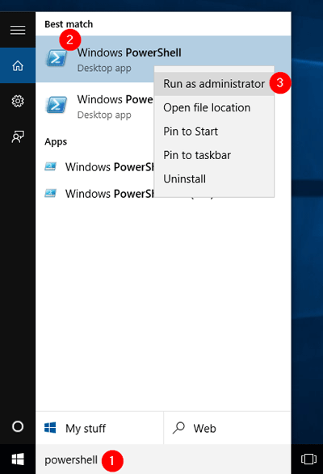
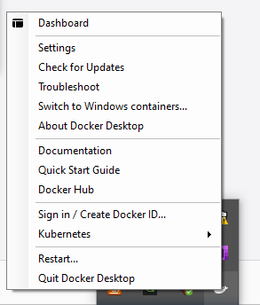
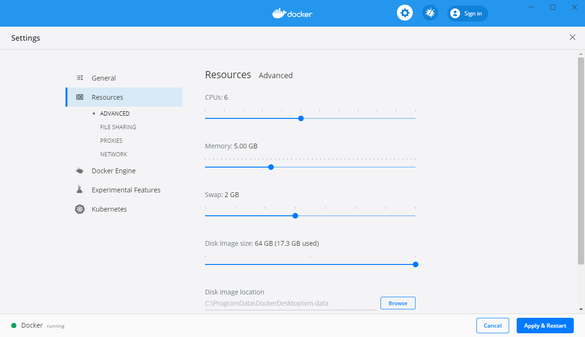
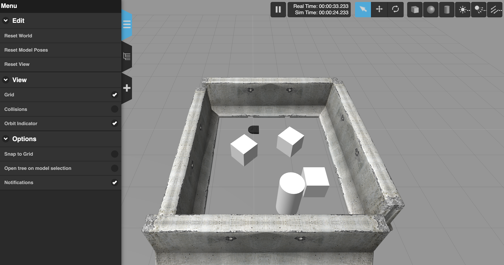
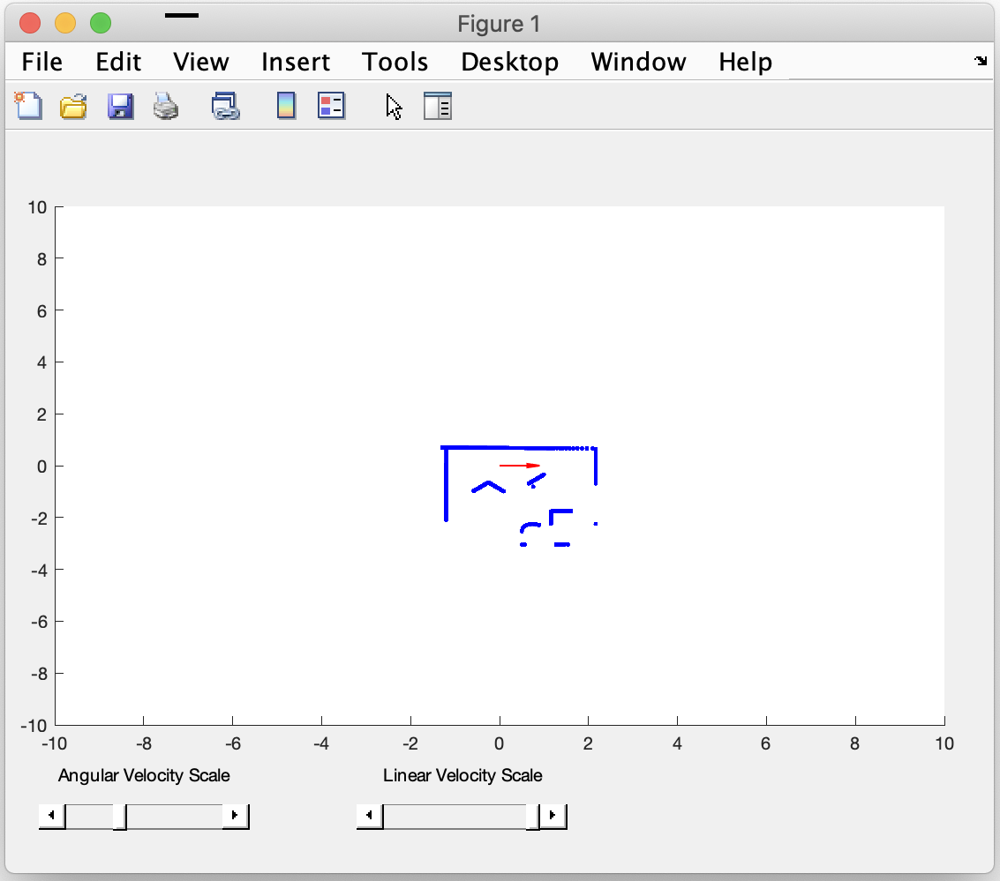

## Purpose of this How-to

This document will help you to get you up and running with your Neato robot.  After following these instructions you will be able to connect to your robot (or a simulated robot), examine its sensor data, and drive it around.

> ***Note for Spring 2021 QEA Students:*** Please excuse the references to the physical robot in this document.  As you probably guessed we won't be able to use them this year, but we did create a really cool simulator for you to use!

## Overview

In this module we will be programming the Neato BotVac. The Neato is a powerful, low cost robot platform that we have customized for QEA (it's also technically a vacuum cleaner, but we'll be ignoring that for this module!). We have engineered the platform to abstract away a lot of the frustrating bits, allowing you to focus on learning the really fun robotics, physics, math, and computing content.

<p align="center">

</p>

The robots have each been outfitted with a Raspberry Pi.  The Raspberry Pi is a low cost, Linux computer that will serve as a bridge between your laptop and the robot.  To use the robot you will initiate a connection from your laptop, via the Olin network, to the Raspberry Pi.  Once the connection has been made, the Raspberry Pi will start talking to the robot.  All sensor data will then be streamed from the Raspberry Pi to your laptop over Olin's wireless network.  Your laptop will process this sensor data and then send motor commands to the robot over the same network.  In this way, all important computation will be done on your laptop.  This architecture simplifies the sharing of robots and makes debugging and editing code as easy as possible.

Since you are not modifying the code running on the Raspberry Pi, each robot will function identically (i.e. there is no software you need to modify on the robot).  While we do have enough robots (31) to give each table their own robot, that wouldn't be optimal.  For example, sometimes your robot will run out of batteries, and you'll want to grab another robot while yours charges.

We'll be programming the robots using ROS.  ROS is a powerful, open-source framework for robotics that has been widely adopted in both industry and academia.  ROS runs natively on Linux, however, we are supporting Windows and Mac OSX via Docker.  Therefore, you can connect to the robots through Windows, Linux, or Mac OSX.

ROS supports several programming languages out of the box, including C++, Python, and Java.  Additionally, MATLAB's Robotics System Toolbox includes support for ROS as well.  In this document and in this module, we will walk you through setting up your environment to connect to the robots using Windows, and we will show you how to program the robots using MATLAB.  Some folks, especially those in SoftDes, may want to use Ubuntu instead.  This is totally fine, and we have instructions [on how to setup your environment for Ubuntu](#notes-for-working-in-linux).  If you'd like, we also have [instructions for using the robots in Mac OSX](#notes-for-working-in-macosx).

## Docker Setup

> Note: when installing Docker, you will have the option to use Docker with Windows Subsystem for Linux 2 (WSL2).  We recommend that you use Docker with the Hyper-V backend, rather than with WSL2.  You can easily switch back-and-forth between the two if you'd like, but we've found the WSL2 backend to be unstable in our testing.

### Highly Recommended Pre-Install Instructions

For lots of folks, you will be able to skip this step, but we have noticed that some of the student Dell laptops will not be able to complete the Docker install process without doing these steps.  In any case, these steps do not hurt to do even if you could have gone through the installation without performing them.  As a result, we encourage you to do them.  If you are interested in why we have to do this, you can check out the Docker help article [Manually Enable Docker for Windows Prerequisites](https://success.docker.com/article/manually-enable-docker-for-windows-prerequisites).

In this step you'll be manually enable the Hyper-V and Container Features, which are both necessary for Docker.  First, run PowerShell by typing "powershell" into the windows search bar, right clicking on Windows PowerShell (not the ISE version), and then selecting "Run as Administrator" in the menu that appears. 



> If you are unfamiliar with how to run PowerShell, here are some links to help you.
> * [5 Ways to Open Windows PowerShell](https://www.isunshare.com/windows-10/5-ways-to-open-windows-powershell-in-windows-10.html)
> * [5 Ways to Run PowerShell as Administrator in Windows 10](https://www.top-password.com/blog/5-ways-to-run-powershell-as-administrator-in-windows-10/)

In the PowerShell window that pops up, type the following two commands (tip: when asked if you want to restart your computer after entering the first command, answer "no", and then answer "yes" to the same question after entering the second command.  This will save you one reboot).

```powershell
Enable-WindowsOptionalFeature -Online -FeatureName containers -All
Enable-WindowsOptionalFeature -Online -FeatureName Microsoft-Hyper-V -All
```

You will likely need to restart your computer after completing these steps. Once you've completed the restart process, you can run the Docker installer.

### Running the Docker Installer

The only operating systems officially supported by ROS are Ubuntu and Debian (although recently Windows support has been introduced, but it is not straightforward to use).  By using a virtual machine we can run an Ubuntu machine from within your Windows setup, which will allow us to run ROS.  The tool we will be using to accomplish this is called Docker.  Docker will allow us to get the QEA robot software installed on your machine in a relatively painless manner (avoiding the need to install and configure a bunch of software packages yourself).

To install Docker, download and run the installer from [DockerHub](https://hub.docker.com/editions/community/docker-ce-desktop-windows/) by clicking the "Get Docker" link. When you see two checkboxes, leave both as is; do not check the third option. You want to run Docker with Linux containers, not Windows containers, so that we can use Docker to run Linux code. Your selections will look like this (note: as mentioned earlier, we recommend not installing the WSL2 components because we found Docker with WSL2 to be unstable in our testing).

<p align="center">

</p>

Once the install is complete you may be asked to restart your computer.

### Making Sure Docker is Setup Properly

Once the Docker installation has completed (and you have possibly restarted your computer), you should bring up the Docker Desktop dashboard by right clicking on its icon in your system tray and clicking on ``Dashboard``.  Here is a picture of the Docker icon (a smiling whale) and where it is located on your system.

<div align="center">

</div>

If everything is working properly, you will a green light in the lower left corner with the sub text "running" (see picture below for what this should look like).  If you don't see this yet, or the dashboard doesn't pop up right away, you might just have to be patient.  It takes a bit of time for Docker to get started after a reboot. Sometimes Docker will say that it will take a few seconds to be up and running, but in our experience it often takes longer. 

Another thing you'll want to check is your Docker settings.  You can get to the settings by clicking the gear icon in Docker Dashboad or by right clicking on the Docker icon in your system tray and clicking Settings (see picture above). Your settings should look like the ones shown below (the send usage statistics and check for updates don't matter, but the others are important).

<div align="center">

</div>

You should also increase the resources given to the Docker Virtual Machine.  To do this, on the settings tab click on resources, and then make the following selections.

<div align="center">

</div>

Once you've made these selections, click ``Apply & Restart``.

As a final check, type the following command into PowerShell (which you can open via the Windows search box).

```powershell
docker run hello-world
```

If all went well, you should see output that starts with text like.

```
Hello from Docker!
This message shows that your installation appears to be working correctly.
```

### Troubleshooting Docker

*Issue:* Docker Installer Got Stuck "Deploying Required Windows Features"

First, if you are having any issues with any of this (e.g., installing Docker), e-mail the QEA teaching team with a description of the problem!  If you ran into the issue where the installer got stuck, it is likely because you need to manually enable the required windows features as described in [this previous section](#highly-recommended-pre-install-instructions).

*Issue:* Docker Installed, but Won't Start 

There are some reports that Windows security features are interfering with the Virtual Machine software that Docker uses.  If Docker still won't start properly (e.g., as indicated when you click on the Docker Desktop icon or when you try to run the hello-world example), try the following steps.


1. Open "Window Security"
2. Open "App & Browser control"
3. Click "Exploit protection settings" at the bottom
4. Switch to "Program settings" tab
5. Locate "C:\WINDOWS\System32\vmcompute.exe" in the list and expand it
6. Click "Edit"
7. Scroll down to "Code flow guard (CFG)" and make sure it is set to "Override system settings" and the toggle immediately below is set to "Off".
8. Start vmcompute from an administrator PowerShell
```powershell
net start vmcompute
```
If this goes well, you should see something indicating that ``vmcompute`` is starting (or has already started).
9. Reboot your computer to give Docker a chance to start up again.  You can then try running the hello world image to see if everything works.

> ***If you still get an error after doing this, revisit the steps above but in step 7 use "Override system settings and put the toggle to "On" with "Use strict CFG" unchecked (we know that it is bizarre to try it both ways, but this is a weird error and there are reports of this working on the Docker forum.  It also worked for one of the Spring 2020 QEA students).***

### Getting Docker to Play Nice with Virtual Box

If you are already running a virtual machine on your system (e.g., for SoftDes), you will need to temporarily disable the Windows Hyper-V feature and reboot your machine.  When you want to use Docker again, you will have to re-enable Hyper-V.  Yes, this is super annoying.  Sorry!  Here are some [instructions for toggling Hyper-V on and off](https://hazaveh.net/2015/11/easily-disable-hyper-v-to-run-vmware-and-virtual-box/) so you can switch back and forth between Virtual Box and Docker.

## Downloading Required MATLAB Toolboxes

Before programming the robot in MATLAB, you will need to have the appropriate MATLAB toolbox installed.  If you followed the instructions from either QEA or ModSim to get your MATLAB installed, you likely will already have the necessary toolboxes.  To see if you are all set, open up MATLAB and type the following at the command prompt.

```matlab
>> rosinit
```

If you get output like the following, then you are good and can skip the rest of this section.

```
Launching ROS Core...
.....Done in 0.4117 seconds.
Initializing ROS master on http://192.168.50.102:11311.
Initializing global node /matlab_global_node_38015 with NodeURI http://PaulRuvosMBP373:54880/
```

If you don't get this output, there are likely two possible error messages you're seeing.

<ol>
<li>You might get an error that the ROS Toolbox is not installed.  If you get an error message about not having the necessary toolbox, you'll need to follow the steps below.

<ul>
<li>If you are using MATLAB R2019b or earlier, you want the Robotics System Toolbox.</li>
<li>If you are using MATLAB R2020a or later, you want the ROS Toolbox.</li>
</ul>

To install additional toolboxes into your MATLAB environment, follow the <a href="http://wikis.olin.edu/it/doku.php?id=matlab">instructions on the IT Wiki for installing MATLAB</a>.  When running the MATLAB installer, make sure to select the appropriate toolbox for the robot (depending on your MATLAB version as described above).
</li>
<li>The second common error you might see is about an <b>"Invalid Python executable"</b>.  If you see this error, then you need to install an appropriate version of Python on your computer.  For the MATLAB ROS Toolbox you'll want Python Version 2.7.  Use the following link to <a href="https://www.python.org/ftp/python/2.7.18/python-2.7.18.amd64.msi">download the installer for Python 2.7</a>.  After you've completed the install of Python 2.7, run the following command in your MATLAB command window (this is assuming you've intalled Python 2.7 in the default location).


>> pyenv('Version', 'C:\Python27\python.exe')


Once you've done this, try to run rosinit again.

</li>
</ol>

### Troubleshooting Toolbox Installation

If you need to install the ROS Toolbox, sometimes MATALB will try to install it without running the full MATLAB installer.  If this process fails, we recommend installing the toolbox through the MATLAB installer.  Follow Olin IT's instructions, linked above, to run the installer.

## Connecting to the Physical Neatos

### Step 1: Grab a battery for the raspberry Pi

Checklist before performing this step:

1. The battery indicator light should be at least level 2 (preferably full)

### Step 2: Choose your Neato

Checklist before performing this step:

1. Make sure the Neato's batteries are charged.  To test this, pull the Neato away from it's charging station and for the newer Neato's hit the button near the front bumper of the Neato that has the home icon on it. For the older Neato's hit the larger orange power button.  The display should illuminate revealing a battery capacity indicator.  Sometimes you will have to click the button below the display to dismiss any errors that show up on the Neato’s screen before the battery level is displayed.

### Step 3: Connect the USB battery pack to the Raspberry Pi's USB cable.

It should take about 1 minute for the robot to be ready to use (see step 4 for a final checklist).

### Step 4: Connecting to the Neato from Your Laptop

Checklist before performing this step:

1. Raspberry pi display backlight is illuminated and not flashing on and off (see troubleshooting section for what to do if this is not the case)
2. Raspberry pi display shows that the Neato is connected to the OLIN-ROBOTICS network and has an IP address assigned to it.
3. Raspberry pi display shows that the signal strength of the Neato's connection is at least 70 (the max is 99) for the wifi dongles with antennas, and at least 50 (max is 65) for the dongles without antennas.  Note: If the signal strength is too low see troubleshooting section for more information.
4. Your laptop is either connected to the ethernet or the OLIN wifi network (Note: this will not work if you are on OLIN-GUEST).

Open PowerShell, enter the following command, and hit enter (unfortunately, the command is super long, but all parts are necessary).  Replace the part that says HOST=192.168.16.68 with the IP address of your robot (the IP address can be found from looking at the display of the Raspberry Pi on your Neato).

```powershell
docker run -e HOST=192.168.16.68 --rm --sysctl net.ipv4.ip_local_port_range="32401 32767" -p 11311:11311 -p 32401-32767:32401-32767 -it qeacourse/robodocker:actual
```

You can verify this worked because the robot will start making a quiet whirring sound and the laser (visible from the side) will start rotating. You should also see in the command window that you are "connected".

### Step 5: Shutting Down the Raspberry Pi

When you are done working with the robot it is important to properly shutdown the raspberry pi. DO NOT just unplug the battery. To shutdown the pi, push the "down" button until you see the message "Press select to Shutdown". Press select and wait for the green "ACT" LED on the left side of the Pi to flash steadily ten times then stay off. It is then safe to unplug the battery.

<p style="text-align: center;">

</p>

### Step 6: Connect through MATLAB

TBD (will update with instructions next time we run QEA with physical robots)


### Troubleshooting Your Neato

*Symptom:* Both the red and green LEDs on the raspberry pi are illuminated and not flashing.

*Potential Cause:* the Pi was unable to boot from its SD card.

<ul>

<li>Solution 1: the first thing to check is that the Raspberry Pi's SD card is fully inserted into the Raspberry Pi.  See the image below for the location of the SD card.  You will know it is fully inserted if you push on the card and it clicks into place.

<p align="center">

</p>
</li>
<li>Solution 2: if the card is fully inserted, the SD card may have become corrupted (possibly because some people didn't properly shutdown the Raspberry Pi!).  Please send me (Paul.Ruvolo@olin.edu) an e-mail and tell me which robot is having the problem.  I'll fix it ASAP, but in the meantime just use another robot.</li>
</ul>

*Symptom:* the raspberry Pi display's backlight is flashing on and off.

*Potential Cause:* the Pi cannot connect to the robot via the USB cable.

* Solution: sometimes the Neato will turn off due to inactivity.  Press button near the front of the Neato’s bumper labeled with the home icon to wake your Neato up.  If that doesn't work, shutdown and then reboot the Pi.  If none of this works, the robot battery might be dead.  Try recharging the robot.  While the robot is recharging, switch to another robot.


### *Symptom:* the Wifi signal strength indicator on the Raspberry Pi is below 60 even though you are right near an access point.

*Problem:* The Pi has connected to an access point that is not the closest one (this will sometimes happen).

* Solution: Assuming the Pi display is at the screen showing the IP address, press right to enter the network setup menu.  OLIN-ROBOTICS should be highlighted with an asterisk.  Press right again to reconnect the Pi to the Wifi.  If it doesn't work the first time, try one more time.  If it doesn't work then, switch to a new robot.


## Connecting to the Simulated Robot

We will be using MATLAB as a means to connect to the your robot (both simulated and physical) and to program it to execute various behaviors.  Note that you need to have the correct MATLAB toolboxes installed in order for this to work (see previous ection).

Start up MATLAB on your computer.

> ***Note:*** unfortunately, the simulator does not work with MATLAB online, so you will need to do interface to the simulator from your local MATLAB install.

Use this [MATLAB drive link](https://drive.matlab.com/sharing/e74dfe9c-44ed-4695-bb93-281bf955050a) to connect to the code for this module.  Once you accept this invitation, navigate to the ``QEASimulators`` directory.  Run the following command in MATLAB.

```matlab
>> qeasim start gauntlet_final
```

If all went well, you will see output that looks like the following.

```
Making sure docker is running
Docker is ready
Shutting down MATLAB ROS Node in case it is running
This might take up to 30 seconds
Shutting down docker container in case it is running

You will have to manually close any simulator visualizations in your browser
If you have yet to download the software, you will see a ton of output
60d3dffd10deb3942e8468631945a8c0538517d6e8b278b41d8133080aab64b5
ROS launched.  Waiting for ROS to be ready.
ROS not yet ready
ROS not yet ready
ROS not yet ready
initializing connection from MATLAB to ROS
Initializing global node /matlab_global_node_22997 with NodeURI http://host.docker.internal:64461/
Connection made.  Checking to see if connection is good.
Connection looks good.  Opening visualizer
If you need to connect from a different browser, use the following link to see the simulator.
http://localhost:8080
```

A browser window should open and display the following visualization of your robot.



### Testing Your Setup

> Note for Fall 2020 QEA Students: even though we are having you test the robot setup, this test will ensure that your setup will work with everything we are going to do in the boats module.

If the visualiation appeared, the next thing you should do is make sure that you can interact with the robot.  Add the ``Robots`` directory to your path and run the ``teleopAndVisualizer`` script.

```matlab
>> addpath('Robots/')
>> teleopAndVisualizer
```

You should see a MATLAB figure come up that looks like this.

<div align="center">

</div>

Next, click on the figure window and drive the robot around using your keyboard (``i`` goes forward, ``j`` turns left, ``k`` stops, and ``l`` turns right).  If you are able to move the robot and you see the figure window shown above, then congratulations your setup is working!  ***Note: these key commands will not work unless you click on the figure window to bring it to the front of your stack of MATLAB windows.***

If you are doing this as part of the boats module, you can go ahead and shutdown the simulator by running the following command.

```matlab
>> qeasim stop
```

You should see the following output.

```
Making sure docker is running
Docker is ready
Shutting down MATLAB ROS Node in case it is running
This might take up to 30 seconds
Shutting down global node /matlab_global_node_07608 with NodeURI http://host.docker.internal:64396/
Shutting down docker container in case it is running
You will have to manually close any simulator visualizations in your browser
ROS simulator has been succcessfully shutdown
```

> Note for Fall 2020 QEA students: there's no need to go any further in this document at this time.

### Troubleshooting

In Fall of 2020 some people are having an issue where they are not able to connect to the simulator properly (this is despite the simulator visualization coming up on their screen).  The most common way this manifests itself is with an error that says ``Cannot create ROS Service Client`` (e.g., when running one of the center of mass simulations) or the obstacle data doesn't show up when running the telop script (no blue dots appear in the image above).  Currently, we are not sure what the root cause of this is.  If you find that this is happening to you, then you should restart Docker.  To restart Docker, bring up the Docker Dashboard, click on the bug icon, and click "Restart Docker".

## Programming Your Robot

Now that you are connected, you can see the list of topics by typing the following command into the command window.

```matlab
>> rostopic list
```

Each of these topics is either a sensor channel (e.g., laser scanner, bump sensor, wheel encoder) or a motor control channel (e.g., ``cmd_vel``, ``raw_vel``, etc.).  Go ahead and display the data flowing across the ``/bump`` topic by typing the following command in the command window.

```matlab
>> rostopic echo /bump
```

You should see output like this.

```matlab
  Data   :  [0, 0, 0, 0]
  Layout    
    DataOffset :  0
    Dim        :  []
```

The interpretation of each of these numbers is dependent on the particular topic you are examining, however, in the case of the /bump topic the four numbers in Data correspond to the output of each of the four bump sensors on the robot.  Go ahead and push the front bumper of the robot to see which bump sensor corresponds to which number.


As always, you can use Ctrl-C to terminate the execution of any Matlab script so you can keep programming.

### Trying the Teleop Script

As a final test of your environment, we're going to drive the robot around a little bit.  Please visit the [teleopAndVisualizer page](../Sample_code/teleopAndVisualizer) to download that script.  Assuming you are connected to the robot or the simulator, you can start that script and drive the robot around with your keyboard. Mappings between individual keys and robot motions are documented in the script itself.

### Your First MATLAB Robotics Program

Let's go ahead and create a program to drive the robot forward until it rams into something.  To do this we'll need to first learn how to control the robot's wheels.  In order to send a velocity to each of the robot's wheels we will need to create a publisher for the ``/raw_vel`` topic.

```matlab
pub = rospublisher('/raw_vel');
```

Once we have a publisher, we can create a message suitable for sending on that topic.

```matlab
msg = rosmessage(pub);
msg.Data = [.1, .1];
send(pub, msg);
```

This message corresponds to telling the robot’s wheels to each move forward at a velocity of 0.1 m/s.


If your robot is not moving, return to your firewall settings and make sure ALL MATLAB inbound rules are as described above. (There could be new inbound rules now that you've connected to the robot.)


We can create subscribers to topics using the rossubscriber command.

```matlab
sub_bump = rossubscriber('/bump');
```

We can put these two together to create a simple program where the robot will move forward with a constant velocity (in this case 0.1 m/s) until one of the bump sensors is triggered.  You can put this code in a MATLAB script (e.g., driveUntilBump.m).


```matlab
pub = rospublisher('/raw_vel');
sub_bump = rossubscriber('/bump');
msg = rosmessage(pub);

% get the robot moving
msg.Data = [0.1, 0.1];
send(pub, msg);

while 1
    % wait for the next bump message
    bumpMessage = receive(sub_bump);

    % check if any of the bump sensors are set to 1 (meaning triggered)
    if any(bumpMessage.Data)
        msg.Data = [0.0, 0.0];
        send(pub, msg);
        break;
    end
end
```

## Disconnecting from the Simulated Robot

When you are ready to stop the simulator, run the following command in MATLAB (making sure that ``qeasim.m`` is either your current directory or in your MATLAB path).

```matlab
>> qeasim stop
```

If all went well, you will see output like the following.

```
Making sure docker is running
Docker is ready
Shutting down MATLAB ROS Node in case it is running
This might take up to 30 seconds
Shutting down global node /matlab_global_node_80051 with NodeURI http://host.docker.internal:58656/
Shutting down docker container in case it is running
You will have to manually close any simulator visualizations in your browser
ROS simulator has been succcessfully shutdown
```


## Notes for working in Linux

You will first need to install MATLAB for Linux.  The [instructions on the IT website](http://wikis.olin.edu/it/doku.php?id=matlab) should work for Linux as well as Windows.  When you are running the installer, make sure to install the ROS Toolbox (if installing R2020a or later) or Robotics System Toolbox (if installing R2019b or earlier).

Follow the [Linux Docker install instructions](https://docs.docker.com/engine/installation/linux/ubuntu/#install-docker)

You want Docker CE, not Docker EE

### Post installation steps

Perform the steps to [manage Docker as a non root user](https://docs.docker.com/engine/installation/linux/linux-postinstall/#manage-docker-as-a-non-root-user). Then restart your computer.

Everything else should work as with Windows.

## Notes for Working in MacOSX

Download [Docker Desktop for Mac](https://hub.docker.com/editions/community/docker-ce-desktop-mac)

Everything else should work as with Windows.
