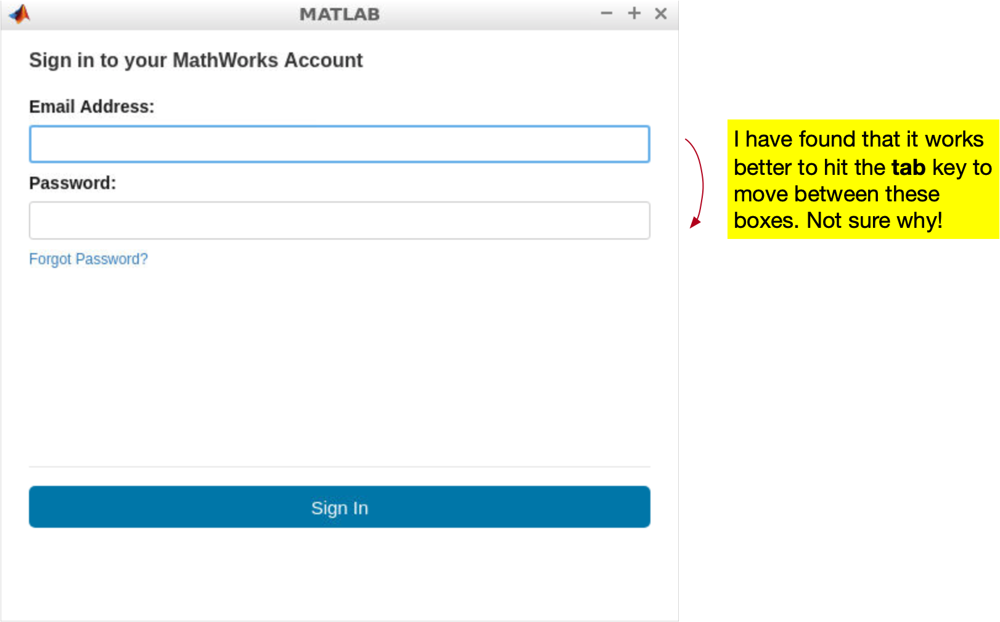

## Purpose of this How-to

This document will help you use the self-contained simulator environmennt for the Robo Ninja Warrior module.

## Differences with the Local Setup

The primary difference with the setup described in [Meeto your Neato](meet_your_neato) is that all of the software necessary to run the simulator and program it are installed on another computer (as opposed to being installed on your computer).  In order to work with the robot you will be acccessing this other computer.  You will be able to start the simualtor, bring up MATLAB, and program the robot to solve the challenge.  The only software you will need on your computer is a web browser.

## Accessing the Self-contained Simulator

### Connecting to the VPN

The first thing you need to do to access the self-contained simulator is to [connect to Olin's VPN](http://wikis.olin.edu/it/doku.php?id=what_is_vpn).  The reason you need to connect to Olin's VPN is that the computer we have installed the robot software on is only accessible from Olin's internal network.

### Connecting to Your Remote Desktop

Once you have connected to the VPN, you can connect to your assigned remote desktop by typing the address that you were sent into your web browser.  Each person will have a different URL, so you need to make sure to use the one that was assigned to you.  The desktop you connect to is a Lubuntu Linux machine.

## Starting the Simulator

When you first connect to the remote desktop a terminal window will pop up.  The terminal window will have instructions for running the simulator.  All you need to do is type the following command into the terminal.
```bash
launch empty_no_spawn
```
If you'd like to run a different world, you can replace ``empty_no_spawn`` with the world name you'd like to access (e.g., ``launch bod_volcano``).  Once you enter this command a visualization of the simulator will pop up, MATLAB will also be started.  In order to use MATLAB, you will have to enter your Mathworks account information (this is to make sure you have a valid license to use MATLAB).  You should see this dialog pop up as MATLAB starts.

<p align="center">	

</p>

Once MATLAB starts, it will automatically execute the appropriate ``rosinit`` command and you will be connected to the robot.

## Coding in MATLAB

You should be able to code in MATLAB pretty much the same way you do on your own machine.  The one thing you absolutely must pay attention to is where you are saving your code.

> Please, please, please do not save code or data to this remote machine.  Instead, you should use MATLAB Drive to save all code and data.  If for some reason I have to restart your remote desktop, all the data you saved on the machine will be lost.  If you use MATLAB Drive, everything will be saved to the cloud and available whenever you need it.

To use MATLAB Drive, you can use [these instructions](https://www.mathworks.com/help/matlabdrive/ug/install-matlab-drive.html#responsive_offcanvas) for installing and setting up the MATLAB Drive Connector.

### Sample Code

As an added bonus, most of the sample code we've been giving this module (although not everything) is preinstalled in the ``Sample_code`` folder.

## Stopping the Simulator

If you want to stop the simulator (e.g., to restart it or because you want to switch worlds), the easiest thing to do is close the terminal that you ran the ``launch`` command from.  This will close MATLAB and the simulator.  When you want to start the simulator again, you can open a new terminal using the shortcut that is preinstalled on the desktop of your remote machine.

## What to Do When You're Done Working for the Day

When you're done for the day, if you'd ilke, you can shut down the simulator using the procecdure in the preceding section.  On the other hand, if you just close the tab on your web browser that you used to connect to the remote machine, you can reconnect later by going to the same URL you used to acccess the remote machine in the first place.  The machine should be just as you left it (everythihng that was running before will still be running)!
