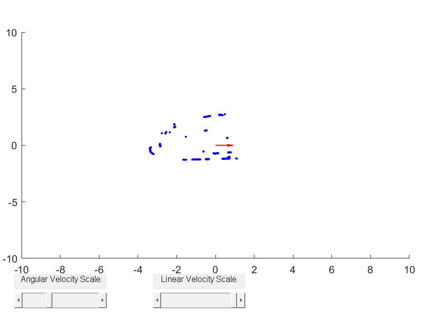

## Teleoperation and LIDAR visualization

The first code you should run is the [teleoperation and LIDAR visualization script](teleopAndVisualizer.md).  The documentation for how to run it is included in the .m file.  If you are using the simulator, and would like to see images from a virtual camera that hovers over the Neato, you can use [teleopAndVisualizerWithImages.m](teleopAndVisualizerWithImages.md).

## Characterizing the Motion of the Neato
* [Make a plot of the Neato's position over time (simulator only)](makeNeatoPositionPlot)
* [Run a Simple Wheel Velocity Experiment (simulator only)](runBasicWheelVelocityExperiment)

## Challenge Code

* [Bridge of Doom Starter Code QEA 2020](starterCodeForBridgeOfDoomQEA2020)
* [Bridge of Doom Solution QEA 2020](bridgeOfDoomQEA2020) (this is a sample solution to the Bridge of Doom challenge for QEA 2020)
* [Bridge of Doom Solution](bridgeOfDoom) (this is a sample solution to the Bridge of Doom challenge)
* [Drive ellipse](driveEllipse) (this shows how to drive a simple parameterized curve))
* A basic [implementation of physical gradient descent](hillClimbing.m).  The Neato can use its onboard accelerometer to reach the top of the mountain using this code.  In the first few iterations of this module we used to have students do this as one of the three challenges.  Recently, we've dropped it due to the complexity of supporting it.
* Building blocks of a solution to the Gauntlet ([find walls](findWalls.m), [find circles](findCircles.m), [make potential fields](makePotentials.m))

## Miscellaneous Robot Code

* [Drive Forward](driveforward)
* [Drive until bump](driveUntilBump), [Drive until bump with velocity input](driveUntilBumpWithVelInput), [Drive until bump then reverse for 5 seconds](driveUntilBumpThenRunAwayForATime)
* [Drive until bump, then run away](driveUntilBumpThenRunAway)
* [Test twist](testTwist.m)
* [Test stop](testStop.m)
* [Symbolic function sample](symbolicFunExample.m) (supports the Bridge of Doom challenge)
